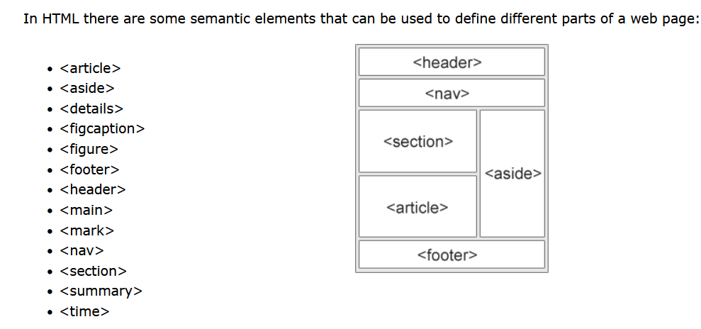

# What I want here

- HTML  
- CSS  
- MERN  
    - mongo
    - express
    - react
    - node.js
- bootstrap

Task1:
duplicate below from scratch using basic HTML & CSS, can reuse assets/
https://dogecoin.com/
https://github.com/dogecoin/dogecoin.com
